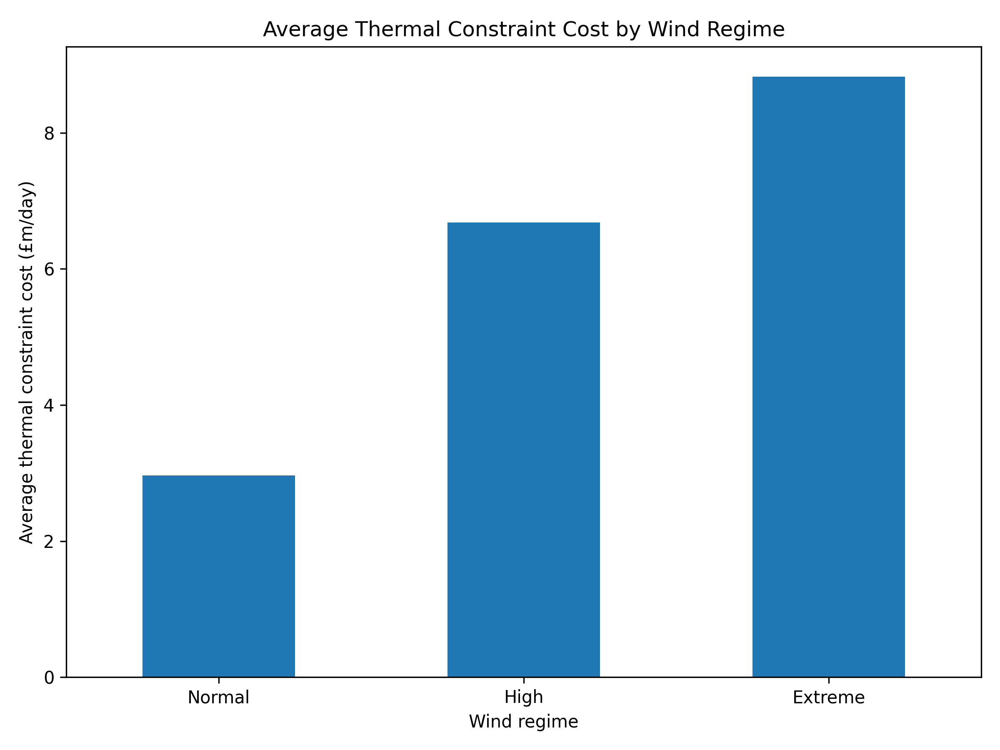
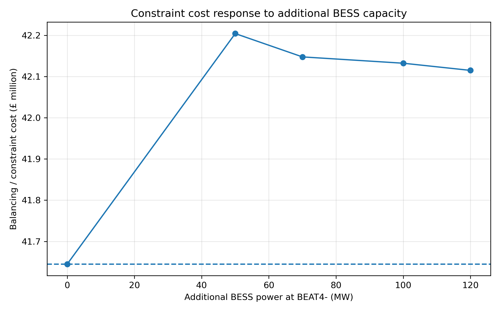
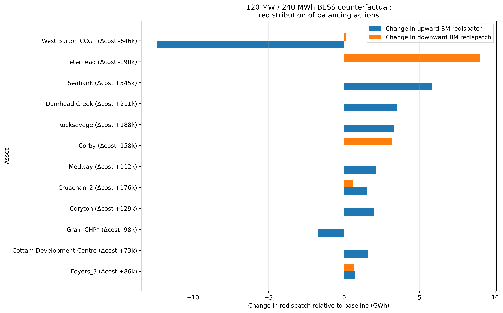

# GB Market Design, Network Constraints and Battery Flexibility

A research project using Elexon and NESO data with PyPSA-GB to examine how commercially scheduled battery storage interacts with transmission constraints and balancing redispatch in Great Britain.

The question behind the project is simple: **if a battery is scheduled against a non-locational wholesale price, will that schedule necessarily be useful to the network once transmission constraints are taken into account?**

The January 2020 counterfactual produced a result that was not obvious in advance. Adding a **120 MW / 240 MWh BESS** at a renewable-constrained model node reduced onshore-wind downward redispatch by about **2.54 GWh** and reduced net physical CCGT generation by about **3.36 GWh**, but modelled balancing/constraint cost increased by about **£0.47 million (+1.13%)**.

This is a model-specific counterfactual, not a claim that batteries generally increase balancing costs. The point of the experiment is to examine the difference between commercial scheduling and network value.

## Background

GB has increasing volumes of renewable generation located far from major demand centres. When transmission capacity is insufficient, the system may need to turn generation down on one side of a constraint and replace it elsewhere. Storage can help, but its behaviour depends on the signal it is responding to.

A system optimiser can place and dispatch a battery to minimise system cost. A commercial battery does something different: it responds to available prices and revenue opportunities. If the price used to form its wholesale schedule does not fully reflect internal network congestion, those two objectives need not produce the same dispatch.

The project therefore combines observed GB data with a controlled model experiment rather than relying on either one alone.

## Empirical context: 2022–2025

Elexon half-hourly generation and demand data were combined with NESO constraint-cost data for 2022–2025. The purpose of this part of the work is to establish the wider context in which the model experiment sits; it is not used to claim causality.

Across the processed daily dataset, mean wind generation was about **177.5 GWh/day**, mean wind share of demand was **28.4%**, and mean thermal-constraint cost was about **£4.11 million/day**. Wind generation and thermal-constraint cost had a correlation of approximately **0.51**; using wind share of demand gave approximately **0.53**.

| Wind regime | Mean thermal constraint cost |
|---|---:|
| Below 75th percentile | £2.96m/day |
| 75th–90th percentile | £6.68m/day |
| 90th percentile and above | £8.83m/day |

Higher-wind days were therefore associated with higher constraint expenditure in this dataset, but transmission outages, demand, generation location, interconnector flows and system-security requirements also affect the result.



## Model experiment

The detailed counterfactual uses the current PyPSA-GB market workflow for January 2020 at half-hourly resolution.

The model is run in two stages. In the wholesale stage, internal transmission constraints are relaxed and generators and eligible storage establish their market positions. In the balancing stage, the transmission network is restored and those positions are adjusted until a network-feasible physical dispatch is obtained. Balancing actions are valued using the bid/offer representation in the market workflow.

This allows the analysis to distinguish between a battery's initial wholesale schedule and the redispatch subsequently required by the network.

### Baseline check

Before adding storage, the January 2020 baseline produced **£41.64 million** of modelled balancing/constraint cost. NESO thermal-constraint expenditure for the corresponding period was approximately **£70.5 million**, so the model reproduced roughly **59%** of the observed magnitude.

These figures are not perfectly like-for-like. I use the comparison as a check that the model is producing a material scale of network-constrained redispatch, not as a claim of full historical validation.

### Battery location and cases

The additional BESS was placed at **BEAT4-**, a model bus identified from the baseline because it showed substantial downward renewable redispatch. The label is used as a model node; no claim is made that it represents a particular investable physical site.

All added batteries have a two-hour duration. The sweep covers 50, 70, 100 and 120 MW in addition to the unchanged baseline.

| Additional BESS | Energy | Model cost | Change from baseline | Wind downward redispatch avoided |
|---:|---:|---:|---:|---:|
| 0 MW | 0 MWh | £41.645m | – | – |
| 50 MW | 100 MWh | £42.204m | +1.34% | 1.735 GWh |
| 70 MW | 140 MWh | £42.148m | +1.21% | 2.238 GWh |
| 100 MW | 200 MWh | £42.132m | +1.17% | 2.155 GWh |
| 120 MW | 240 MWh | £42.115m | +1.13% | 2.540 GWh |

The 120 MW case has the lowest cost among the added-BESS cases and the largest wind-redispatch reduction among the capacities tested. It is **not** an optimum: every added-BESS case still has a higher balancing/constraint cost than the no-additional-BESS baseline.



## What changes in the 120 MW case?

The new battery is active in the wholesale stage but makes essentially **no direct balancing-mechanism adjustment** in the second stage. Its wholesale discharge is about 3.39 GWh over the month, equivalent to roughly 14.1 discharge cycles for the 240 MWh system.

The additional balancing cost is therefore mostly indirect. The battery changes the wholesale system position, and the constrained balancing problem subsequently finds a different redispatch pattern across the rest of the fleet.

For CCGTs, the important distinction is between gross redispatch and net physical generation. Relative to the baseline, the 120 MW case adds about **10.33 GWh** of upward CCGT redispatch and **13.75 GWh** of downward CCGT redispatch. Net physical CCGT generation nevertheless falls by approximately **3.36 GWh**. The result is more two-sided redispatch rather than simply more gas generation.

The main changes in the model objective are approximately:

| Carrier | Change in net redispatch contribution |
|---|---:|
| CCGT | +£296k |
| Pumped storage | +£253k |
| Onshore wind | -£67k |
| Oil | -£19k |

The new battery's own direct balancing contribution is negligible. Most of the cost change comes from the way other assets are moved around the network.

At individual-asset level, some CCGTs are moved less upward, others more upward, and several are moved further downward. Existing pumped-storage units also change behaviour. This is why a carrier-level statement such as “more CCGT redispatch” should not be interpreted as “more CCGT generation”.



## Interpretation

Within this January 2020 model setup, the BESS improves renewable utilisation but does not lower balancing cost. That is the main result of the project.

A plausible interpretation is that the battery is responding to a wholesale signal formed without the full internal transmission network, while the balancing stage has to respect that network. The battery can therefore take a commercially sensible wholesale position without necessarily taking the position that minimises subsequent network redispatch.

The experiment does not yet quantify the full gap between commercial and system-optimal flexibility. A direct comparison with a network-aware or locational BESS schedule is the next test required to do that properly.

## How the research question changed

The project did not start with the final market-design question. Several earlier results were useful precisely because they did not survive further testing.

| Attempt | Why it was not used as the main result |
|---|---|
| January-only 2015 physical curtailment result | The apparent end-of-month curtailment disappeared when the optimisation horizon was extended. I treated it as a horizon-boundary artefact rather than a physical result. |
| Full-year monolithic network solve | The problem exceeded the available workstation memory. |
| Rolling-horizon solve | It solved, but limited foresight produced materially different curtailment behaviour. I retained it only as a sensitivity. |
| Manually inserted generic BESS | It answered a system-optimisation question rather than the final question about commercially scheduled storage followed by network-constrained balancing. |

Those tests are retained in the repository because they explain why the final design looks the way it does. I would rather document a rejected result than build the argument around one that is sensitive to an implementation choice.

## Limitations

The principal counterfactual covers January 2020 rather than a full year, so seasonal robustness remains to be tested. The 2022–2025 empirical analysis provides broader context but is not a validation of the January 2020 battery result.

The modelled balancing objective and NESO thermal-constraint expenditure are also not identical accounting measures. The baseline comparison should therefore be read as an order-of-magnitude validation check.

The current PyPSA-GB baseline includes a sizeable battery fleet. This differs from the historical-storage description in the 2024 PyPSA-GB paper, which reflects an earlier model version. Because all counterfactuals use the same baseline, the incremental comparison is internally controlled, but historical fleet-vintage consistency deserves further work.

Finally, the study does not yet include a network-aware battery counterfactual, participant-specific bidding strategies or agent-based behaviour. Those are natural extensions rather than assumptions hidden inside the present result.

## Repository contents

```text
gb-market-design-bess/
├── data/
│   └── processed/
├── figures/
├── notebooks/
├── results/
├── scripts/
├── README.md
└── .gitignore
```

The notebooks record exploratory work and are kept for research provenance. The scripts are the main analysis interface.

Key scripts are:

- `fetch_elexon_core.py` and `fetch_neso_constraints.py` for public-data retrieval
- `build_empirical_daily.py` and `analyse_empirical_constraints.py` for the empirical layer
- `find_bess_candidate_bus.py` for candidate-node screening
- `prepare_bess_sweep_networks.py` for the controlled BESS cases
- `analyse_bess_sweep.py` for the capacity-sweep summary
- `diagnose_wholesale_physical_gap.py` and `plot_asset_redispatch.py` for mechanism diagnostics

Raw downloads, large PyPSA network files and weather cutouts are intentionally excluded from this repository.

## Reproducibility

The research code is kept separate from PyPSA-GB. Model-dependent scripts expect the two repositories to sit next to each other:

```text
parent-directory/
├── PyPSA-GB/
└── gb-market-design-bess/
```

The model experiments were run against:

- **PyPSA:** 1.0.7
- **Snakemake:** 9.13.4
- **Solver:** HiGHS / highspy
- **PyPSA-GB commit:** `8e084afe4fb2d4be86f270d3f12ad3315eee2a3a`

To pin the same PyPSA-GB source revision:

```bash
git clone https://github.com/andrewlyden/PyPSA-GB.git
cd PyPSA-GB
git checkout 8e084afe4fb2d4be86f270d3f12ad3315eee2a3a
```

The empirical scripts can be run from this repository. Re-running the native January 2020 market counterfactual additionally requires the corresponding PyPSA-GB input data, network resources, market configuration and weather data.

For example, once the native scenario outputs are available:

```bash
python scripts/analyse_bess_sweep.py
python scripts/diagnose_wholesale_physical_gap.py
python scripts/plot_asset_redispatch.py
```

The first command can reproduce the published capacity-sweep tables and figures from the completed scenario summaries. The two diagnostic scripts read native PyPSA-GB market/network outputs from the sibling repository.

## Next steps

The most useful extension is not simply to add more battery capacity. It is to run the same asset under two scheduling regimes: the present uniform-price wholesale schedule and a network-aware or locational schedule. That would allow the market-design gap to be measured directly in terms of balancing cost, renewable redispatch, battery revenue and network congestion.

Seasonal robustness is the second priority. A full-year or carefully selected seasonal 2020 study would show whether the January mechanism persists under different demand, renewable and network conditions before attempting a broader multi-year native counterfactual.

## References

1. Lyden, A., Sun, W., Struthers, I., Franken, L., Hudson, S., Wang, Y. and Friedrich, D. (2024). *PyPSA-GB: An open-source model of Great Britain's power system for simulating future energy scenarios*. **Energy Strategy Reviews, 53**, 101375. https://doi.org/10.1016/j.esr.2024.101375
2. PyPSA-GB source repository: https://github.com/andrewlyden/PyPSA-GB
3. Elexon BSC Open Data API: https://data.elexon.co.uk/bmrs/api/v1
4. NESO Open Data Portal: https://www.neso.energy/data-portal

---

This repository is an independent research project built using PyPSA-GB. It is not an official PyPSA-GB, Elexon or NESO publication.